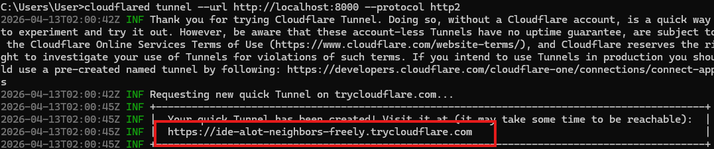
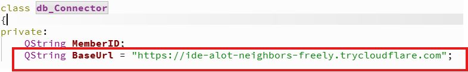

# MiniProject_RunningMachine
부경대IoT 미니프로젝트 과제


# Qt 사용법

## UI 관련
1. 기본적으로 UI 배치는 mainwindow.ui 라는 파일에서 작업한다.

2. 


## 화면 전환 관련
1. 기본적으로 화면은 하나지만 여러개로 작업하고 싶다면 stackedWidget이라는 콘테이너 객체를 화면에 드래그해서 넣는다.
    - 그러면 ObjectInspector창에서 stackedWidget 오브젝트를 마우스 우클릭하고 InsertPage를 통해 여러개의 페이지를 만들수 있다.
    - 이러면 페이지 하나당 내가 전환하고픈 화면 하나인 것이다.

2. 화면을 전환하는 방법
    - cpp파일에서 UI::MainWindow 객체의 포인터를 사용해서 전환한다. 페이지가 몇번 인덱스인지 기억하기 힘드므로 `2번 방법을 추천`한다.
        - ex_1    ui->stackedWidget->SetCurrentIndex(전환하고픈 화면의 인덱스);
        - ex_2    ui->stackedWidget->SetCurrentWidget(ui->전환하고픈 페이지 객체의 이름);

    **작동을 하면 기본적으로 내가 ui에서 작업하던 화면으로 시작을 해버리니, MainWidow 생성자에서 화면을 초기화해주는 것이 좋다.**
    


## 버튼 관련
1. 버튼 누름 관련 함수
    - 게임엔진처럼 버튼을 눌렀을때 실행할 함수를 연결할수있다.
        - 기본적으로 Qt에서 제공하는 기능이며, mainwindow.ui에서 실행하고자 할 버튼을 우클릭 하고 "Go to slot..."을 누르면 원하는 함수를 바인딩할수있다.
        - 바인딩할 함수를 클릭하면 mainwindow.h와 cpp파일에 함수가 생긴다. 보통 함수명은 "on_버튼객체명_clicked()"와 같이 생성되며, 이런식의 함수 이름으로 되어있다면 Qt에서 자동으로 그 버튼에 이 함수를 바인딩해준다.

## 꾸미기 관련
#### `객체의 Property에서 "styleSheet" 부분에 입력한다.`
1. 테두리1(테두리 전체 색칠)
    - 테두리가 없는 객체들이 많다. 이것을 해결하기 위해서는 그 객체의 Property에서 "styleSheet" 부분에 "border: 1px solid black;" 라는 것을 입력하면 검은색의 테두리가 생긴다.

2. 테두리2(부분 테두리 색칠)
    - 테두리 하나하나만 하고 싶을때 사용하는 코드이다. 예를들어 Frame이 사각형인데, 각 방향으로 원하는 곳만 색칠하고 싶다면 방향을 입력해야한다.
        - ex_1  border-right: 2px solid black;  // 사각형중에 오른쪽 부분을 검은색으로 칠한다.
        - ex_2  border-left:none;    // 사각형중 왼쪽은 칠하지 않는다.

3. 테두리3(각진 부분 없애기)
    - Framer같은 거라던가 사각형의 모서리 부분이 각지지 않고 약간 둥글수 있다. 그때 각지게 만들어주고 싶다면 다음과 같이 입력한다.
        - ex_1 border-radius: 0px;

4. 특정 객체만 적용하기
    - Frame안에 자식 객체들이 있으면 내가 Frame에 "border: 1px solid black;"으로 색을 칠하면 안에 있는 객체들까지 전부 동일하게 적용된다. 이때 Frame만 적용하고 싶다면 다음과 같이 입력한다. 
        - ex_1 #프레임객체명{border: 2px solid black;}  // 이러면 프레임객체명의 객체만 적용된다. 반드시 중괄호로 감싸줘야하는걸 잊지말자.

5. 색깔 변경
    - background-color: #3498db;  이렇게 색깔 코드를 입력하면 버튼이라던가 라벨등의 백그라운드 색깔이 변경된다.
    - color: white; 이것은 버튼이나 라벨등 안에 있는 글자의 색깔을 변경하는 코드다.

6. 버튼 모양 둥글게(원형)
    - 기본적으로 버튼등은 사각형 모양으로 시작한다. 그것을 완전 원형으로 변경하려면 다음의 예제처럼 하면 된다.
        - ex_1  width: 50px; height: 50px; border-radius: 25px;   /* 크기의 절반 */ 
        - 이처럼 가로, 세로의 길이를 동일하게하고 모서리부분을 그것의 절반으로 설정하면 완전한 타원형이 된다.


# 데이터베이스 연동하는 방법1 (내 컴퓨터에서만)
1. 시작 메뉴에서 QT라고 입력하면 Qt전용 콘솔앱이 나온다. 그것을 실행한다.

2. 콘솔 입력
    - cd /d 
    - C:\SourceBank\MiniProject_RunningMachine\MiniProject1\build\Desktop_Qt_6_11_0_MinGW_64_bit-Debug
    - 이렇게 실행을 하면 Qt 관련 라이브러리와 플러그인을 실행 폴더로 복사해 준다.

3. 확인용 코드로 확인
    ```cpp
    #include "db_connector.h"

    #include <QSqlDatabase>
    #include <QSqlQuery>
    #include <QSqlError>
    #include <QSqlDriver>
    #include <QVariant>
    #include <QDebug>
    #include <QCoreApplication>

    db_Connector::db_Connector()
    {
        qDebug() << "실행 폴더:" << QCoreApplication::applicationDirPath();
        qDebug() << "라이브러리 경로들:" << QCoreApplication::libraryPaths();
        qDebug() << "사용 가능한 드라이버 목록:" << QSqlDatabase::drivers();
    }
    ```
    위와같은 방식으로 확인했을때, 사용 가능한 드라이버 목록에 "QODBC"가 나온다면 사용 가능한 상태이다.

4. ODBC를 사용해서 MySql에 사용하기 위해 MySQL 사이트에서 설치 파일 다운로드하고 설치
    - 주소 : https://dev.mysql.com/downloads/connector/odbc/?utm_source=chatgpt.com 에서 Windows (x86, 64-bit), MSI Installer 다운로드 후 설치한다.

5. ODBC 설치확인
    - 시작메뉴에서 `ODBC 데이터 원본` 이라고 검색한다. 
        - `ODBC 데이터 원본(64비트)`라는게 보인다면 실행한다.
        - `드라이버`탭에 들어간다.
        - `MySQL ODBC 9.6 Unicode Driver`가 있다면 설치확인 완료이다.

6. db와 연결
```cpp
bool db_Connector::Connect()
    {
        QSqlDatabase db = QSqlDatabase::addDatabase("QODBC");

        db.setDatabaseName(
            "DRIVER={MySQL ODBC 9.6 Unicode Driver};"
            "SERVER=127.0.0.1;"
            "DATABASE=RunRecordDB;"
            "USER=KYS;"
            "PASSWORD=KYS123456;"
            "PORT=3306;"
            "OPTION=3;"
        );

        if (!db.open())
        {
            qDebug() << "DB 연결 실패:" << db.lastError().text();
            return false;
        }

        qDebug() << "DB 연결 성공";
        return true;
    }
```

7. db에 저장
```cpp
    // 저장할때 입력한 멤버ID가 DB에 없으면 멤버 ID를 생성하여 저장
    bool db_Connector::EnsureMemberExists(int memberId) 
    {
        QSqlQuery query;
        query.prepare("INSERT IGNORE INTO Member (member_id) VALUES (:member_id)");
        query.bindValue(":member_id", memberId);

        if (!query.exec())
        {
            qDebug() << "Member 등록 실패:" << query.lastError().text();
            return false;
        }

        return true;
    }

    // DB에 저장
    bool db_Connector::SaveRecord(int memberId, double runTime, double avgSpeed, double distance, double calorie)
    {
        if (!EnsureMemberExists(memberId))  
        {
            return false;
        }

        QSqlQuery query;
        query.prepare(
            "INSERT INTO RunningRecord "
            "(member_id, run_time, avg_speed, distance, calorie) "
            "VALUES (:member_id, :run_time, :avg_speed, :distance, :calorie)"
            );

        query.bindValue(":member_id", memberId);
        query.bindValue(":run_time", runTime);
        query.bindValue(":avg_speed", avgSpeed);
        query.bindValue(":distance", distance);
        query.bindValue(":calorie", calorie);

        if (!query.exec())
        {
            qDebug() << "기록 저장 실패:" << query.lastError().text();
            return false;
        }

        qDebug() << "기록 저장 성공";
        return true;
    }
```

# 데이터베이스 연동하는 방법2 (서버를 이용해서? 터널을 열어서?)
1. 일단 파이썬은 무조건 설치가 되어 있어야한다.

2. 파이썬 파일들을 모아서 실행할 폴더를 생성한다.("RunRecordServer"라는 이름의 폴더를 만들었었다.)

3. 폴더 위치에서 cmd창을 켜고 다음의 코드를 순서대로 실행하여 가상환경을 켠다.
    ```py
    python -m venv venv # 가상환경을 만든다

    venv\Scripts\activate # 가상환경을 켠다
    ```

4. 가상환경이 켜진 상태에서 다음의 코드를 순서대로 실행한다.
    ```cmd
    pip install Flask

    pip install mysql-connector-python
    ```

5. RunRecordServer폴더에서 `"config.py"` 파일을 만든다. 파일의 내용은 다음과 같다.
    ```py
    DB_CONFIG = {
    "host": "127.0.0.1",
    "user": "KYS",
    "password": "KYS123456",
    "database": "RunRecordDB"
    }

    SERVER_HOST = "0.0.0.0"
    SERVER_PORT = 8000      # 이 포트 번호가 안되면 다른걸로 바꿔도 된다.
    ```

6.  RunRecordServer폴더에서 `"app.py"` 파일을 만든다. 파일의 내용은 다음과 같다.
    ```py
    from flask import Flask, request, jsonify
    import mysql.connector
    from config import DB_CONFIG, SERVER_HOST, SERVER_PORT

    app = Flask(__name__)


    def get_connection():
        return mysql.connector.connect(
            host=DB_CONFIG["host"],
            user=DB_CONFIG["user"],
            password=DB_CONFIG["password"],
            database=DB_CONFIG["database"]
        )


    @app.route("/member/exists", methods=["POST"])
    def member_exists():
        data = request.get_json()

        if not data or "member_id" not in data:
            return jsonify({"success": False, "message": "member_id is required"}), 400

        member_id = data["member_id"]

        try:
            conn = get_connection()
            cursor = conn.cursor()

            query = "SELECT COUNT(*) FROM Member WHERE member_id = %s"
            cursor.execute(query, (member_id,))
            count = cursor.fetchone()[0]

            cursor.close()
            conn.close()

            return jsonify({
                "success": True,
                "exists": count >= 1
            })

        except Exception as e:
            return jsonify({
                "success": False,
                "message": str(e)
            }), 500


    @app.route("/member/create", methods=["POST"])
    def member_create():
        data = request.get_json()

        if not data or "member_id" not in data:
            return jsonify({"success": False, "message": "member_id is required"}), 400

        member_id = data["member_id"]

        try:
            conn = get_connection()
            cursor = conn.cursor()

            query = "INSERT IGNORE INTO Member (member_id) VALUES (%s)"
            cursor.execute(query, (member_id,))
            conn.commit()

            cursor.close()
            conn.close()

            return jsonify({
                "success": True,
                "message": "member created"
            })

        except Exception as e:
            return jsonify({
                "success": False,
                "message": str(e)
            }), 500


    @app.route("/record/save", methods=["POST"])
    def record_save():
        data = request.get_json()

        required_keys = ["member_id", "run_time", "avg_speed", "distance", "calorie"]
        if not data or any(key not in data for key in required_keys):
            return jsonify({"success": False, "message": "missing required fields"}), 400

        try:
            conn = get_connection()
            cursor = conn.cursor()

            query = """
                INSERT INTO RunningRecord
                (member_id, run_time, avg_speed, distance, calorie)
                VALUES (%s, %s, %s, %s, %s)
            """
            cursor.execute(
                query,
                (
                    data["member_id"],
                    data["run_time"],
                    data["avg_speed"],
                    data["distance"],
                    data["calorie"]
                )
            )
            conn.commit()

            cursor.close()
            conn.close()

            return jsonify({
                "success": True,
                "message": "record saved"
            })

        except Exception as e:
            return jsonify({
                "success": False,
                "message": str(e)
            }), 500


    @app.route("/record/inquiry", methods=["POST"])
    def record_inquiry():
        data = request.get_json()

        required_keys = ["member_id", "start_date", "end_date"]
        if not data or any(key not in data for key in required_keys):
            return jsonify({"success": False, "message": "missing required fields"}), 400

        try:
            conn = get_connection()
            cursor = conn.cursor(dictionary=True)

            query = """
                SELECT
                    record_date,
                    run_time,
                    avg_speed,
                    distance,
                    calorie
                FROM RunningRecord
                WHERE member_id = %s
                AND record_date BETWEEN %s AND %s
                ORDER BY record_date DESC
            """

            start_datetime = data["start_date"] + " 00:00:00"
            end_datetime = data["end_date"] + " 23:59:59"

            cursor.execute(query, (data["member_id"], start_datetime, end_datetime))
            rows = cursor.fetchall()

            result = []
            for row in rows:
                total_seconds = int(row["run_time"])

                hour = total_seconds // 3600
                minute = (total_seconds % 3600) // 60
                second = total_seconds % 60

                run_time_text = f"{hour:02d}:{minute:02d}:{second:02d}"

                result.append({
                    "record_date": row["record_date"].strftime("%Y-%m-%d %H:%M"),
                    "run_time": run_time_text,
                    "avg_speed": float(row["avg_speed"]),
                    "distance": float(row["distance"]),
                    "calorie": float(row["calorie"])
                })

            cursor.close()
            conn.close()

            return jsonify({
                "success": True,
                "records": result
            })

        except Exception as e:
            return jsonify({
                "success": False,
                "message": str(e)
            }), 500


        if __name__ == "__main__":
        app.run(host=SERVER_HOST, port=SERVER_PORT, debug=True)    
    ```

7. RunRecordServer의 폴더에서 가상환경이 계속 켜진 상태에서 다음과 같이 입력하여 서버실행을 한다.
    ```cmd
    python app.py

     * Running on http://127.0.0.1:8000  # 제대로 실행된다면 나올 문장이다.
    ```

8. 서버와 연결이 제대로 됐고, db와 연결됐는지 확인을 해본다. `현재 가상환경이 켜져있는 cmd창 이외에 RunRecordServer 폴더의 다른 cmd창을 열고 다음과 같이 입력한다.`
    ```cmd
    Invoke-RestMethod -Uri "http://127.0.0.1:8000/member/exists" -Method Post -ContentType "application/json" -Body '{"member_id":"abc123"}' # abc123 이라는 ID가 있는지 확인

    Invoke-RestMethod -Uri "http://127.0.0.1:8000/member/create" -Method Post -ContentType "application/json" -Body '{"member_id":"abc123"}' # abc123이라는 ID를 생성

    Invoke-RestMethod -Uri "http://127.0.0.1:8000/record/save" -Method Post -ContentType "application/json" -Body '{"member_id":"abc123","run_time":120.0,"avg_speed":8.5,"distance":0.283,"calorie":15.2}' # abc123의 아이디에 기록을 저장

    Invoke-RestMethod -Uri "http://127.0.0.1:8000/record/inquiry" -Method Post -ContentType "application/json" -Body '{"member_id":"abc123","start_date":"2026-04-01","end_date":"2026-04-30"}'  # abc123의 아이디에 기록이 있는지 확인
    ```

9. CMakeLists.txt를 다음과 같이 수정
    ```txt
        cmake_minimum_required(VERSION 3.16)

    project(MiniProject1 VERSION 0.1 LANGUAGES CXX)

    set(CMAKE_AUTOUIC ON)
    set(CMAKE_AUTOMOC ON)
    set(CMAKE_AUTORCC ON)

    set(CMAKE_CXX_STANDARD 17)
    set(CMAKE_CXX_STANDARD_REQUIRED ON)

    find_package(QT NAMES Qt6 Qt5 REQUIRED COMPONENTS Widgets Sql Network LinguistTools)
    find_package(Qt${QT_VERSION_MAJOR} REQUIRED COMPONENTS Widgets Sql Network LinguistTools)

    set(TS_FILES MiniProject1_ko_KR.ts)

    set(PROJECT_SOURCES
        main.cpp
        mainwindow.cpp
        mainwindow.h
        mainwindow.ui
        ${TS_FILES}
    )

    if(${QT_VERSION_MAJOR} GREATER_EQUAL 6)
        qt_add_executable(MiniProject1
            MANUAL_FINALIZATION
            ${PROJECT_SOURCES}
            Calculator.h
            Calculator.cpp
            TimeCalculator.h
            TimeCalculator.cpp
            speedcalculator.h
            speedcalculator.cpp
            distancecalculator.h
            distancecalculator.cpp
            caloriecalculator.h
            caloriecalculator.cpp
            db_connector.h
            db_connector.cpp
        )

        qt_create_translation(QM_FILES ${CMAKE_SOURCE_DIR} ${TS_FILES})
    else()
        if(ANDROID)
            add_library(MiniProject1 SHARED
                ${PROJECT_SOURCES}
            )
        else()
            add_executable(MiniProject1
                ${PROJECT_SOURCES}
            )
        endif()

        qt5_create_translation(QM_FILES ${CMAKE_SOURCE_DIR} ${TS_FILES})
    endif()

    target_link_libraries(MiniProject1
        PRIVATE
        Qt${QT_VERSION_MAJOR}::Widgets
        Qt${QT_VERSION_MAJOR}::Sql
        Qt${QT_VERSION_MAJOR}::Network
    )

    if(${QT_VERSION} VERSION_LESS 6.1.0)
        set(BUNDLE_ID_OPTION MACOSX_BUNDLE_GUI_IDENTIFIER com.example.MiniProject1)
    endif()

    set_target_properties(MiniProject1 PROPERTIES
        ${BUNDLE_ID_OPTION}
        MACOSX_BUNDLE_BUNDLE_VERSION ${PROJECT_VERSION}
        MACOSX_BUNDLE_SHORT_VERSION_STRING ${PROJECT_VERSION_MAJOR}.${PROJECT_VERSION_MINOR}
        MACOSX_BUNDLE TRUE
        WIN32_EXECUTABLE TRUE
    )

    include(GNUInstallDirs)
    install(TARGETS MiniProject1
        BUNDLE DESTINATION .
        LIBRARY DESTINATION ${CMAKE_INSTALL_LIBDIR}
        RUNTIME DESTINATION ${CMAKE_INSTALL_BINDIR}
    )

    if(QT_VERSION_MAJOR EQUAL 6)
        qt_finalize_executable(MiniProject1)
    endif()
    ```

10. db_connector.h의 파일을 다음과 같이 수정
    ```h
        #pragma once

    #include <QString>
    #include <QJsonArray>

    class db_Connector
    {
    private:
        QString MemberID;
        QString BaseUrl = "https://ide-alot-neighbors-freely.trycloudflare.com";  // 여기는 추후에 나올 가상주소를 받고나서 그 주소를 여기다가 똑같이 입력해야한다. 

    public:
        inline void SetMemberID(QString MemberID) { this->MemberID = MemberID; }
        inline QString GetMemberId() const { return MemberID; }

        db_Connector();

        bool Connect();

        bool MemberExists();

        bool SaveRecord(double runTime, double avgSpeed, double distance, double calorie);

        void InsertMemberID();

        void InquiryRecord(class QTableWidget& RecordTable, QString StartDate, QString EndDate);
    };
    ```

11. db_connector.cpp 파일을 다음과 같이 수정
    ```cpp
    #include "db_connector.h"

    #include <QNetworkAccessManager>
    #include <QNetworkRequest>
    #include <QNetworkReply>
    #include <QEventLoop>
    #include <QJsonDocument>
    #include <QJsonObject>
    #include <QJsonArray>
    #include <QTableWidget>
    #include <QTableWidgetItem>
    #include <QUrl>
    #include <QDebug>

    db_Connector::db_Connector()
    {
    }

    bool db_Connector::Connect()
    {
        QNetworkAccessManager manager;
        QNetworkRequest request(QUrl(BaseUrl + "/member/exists"));
        request.setHeader(QNetworkRequest::ContentTypeHeader, "application/json");

        QJsonObject json;
        json["member_id"] = "test_connection";

        QNetworkReply* reply = manager.post(request, QJsonDocument(json).toJson());

        QEventLoop loop;
        QObject::connect(reply, &QNetworkReply::finished, &loop, &QEventLoop::quit);
        loop.exec();

        if (reply->error() != QNetworkReply::NoError)
        {
            qDebug() << "서버 연결 실패:" << reply->errorString();
            reply->deleteLater();
            return false;
        }

        qDebug() << "서버 연결 성공";
        reply->deleteLater();
        return true;
    }

    bool db_Connector::MemberExists()
    {
        QNetworkAccessManager manager;
        QNetworkRequest request(QUrl(BaseUrl + "/member/exists"));
        request.setHeader(QNetworkRequest::ContentTypeHeader, "application/json");

        QJsonObject json;
        json["member_id"] = MemberID;

        QNetworkReply* reply = manager.post(request, QJsonDocument(json).toJson());

        QEventLoop loop;
        QObject::connect(reply, &QNetworkReply::finished, &loop, &QEventLoop::quit);
        loop.exec();

        if (reply->error() != QNetworkReply::NoError)
        {
            qDebug() << "회원 존재 확인 실패:" << reply->errorString();
            reply->deleteLater();
            return false;
        }

        QByteArray responseData = reply->readAll();
        reply->deleteLater();

        QJsonDocument doc = QJsonDocument::fromJson(responseData);
        QJsonObject obj = doc.object();

        return obj["exists"].toBool();
    }

    void db_Connector::InsertMemberID()
    {
        QNetworkAccessManager manager;
        QNetworkRequest request(QUrl(BaseUrl + "/member/create"));
        request.setHeader(QNetworkRequest::ContentTypeHeader, "application/json");

        QJsonObject json;
        json["member_id"] = MemberID;

        QNetworkReply* reply = manager.post(request, QJsonDocument(json).toJson());

        QEventLoop loop;
        QObject::connect(reply, &QNetworkReply::finished, &loop, &QEventLoop::quit);
        loop.exec();

        if (reply->error() != QNetworkReply::NoError)
        {
            qDebug() << "회원 생성 실패:" << reply->errorString();
        }
        else
        {
            qDebug() << "회원 생성 성공";
        }

        reply->deleteLater();
    }

    bool db_Connector::SaveRecord(double runTime, double avgSpeed, double distance, double calorie)
    {
        QNetworkAccessManager manager;
        QNetworkRequest request(QUrl(BaseUrl + "/record/save"));
        request.setHeader(QNetworkRequest::ContentTypeHeader, "application/json");

        QJsonObject json;
        json["member_id"] = MemberID;
        json["run_time"] = runTime;
        json["avg_speed"] = avgSpeed;
        json["distance"] = distance;
        json["calorie"] = calorie;

        QNetworkReply* reply = manager.post(request, QJsonDocument(json).toJson());

        QEventLoop loop;
        QObject::connect(reply, &QNetworkReply::finished, &loop, &QEventLoop::quit);
        loop.exec();

        if (reply->error() != QNetworkReply::NoError)
        {
            qDebug() << "기록 저장 실패:" << reply->errorString();
            reply->deleteLater();
            return false;
        }

        QByteArray responseData = reply->readAll();
        reply->deleteLater();

        QJsonDocument doc = QJsonDocument::fromJson(responseData);
        QJsonObject obj = doc.object();

        return obj["success"].toBool();
    }

    void db_Connector::InquiryRecord(QTableWidget& RecordTable, QString StartDate, QString EndDate)
    {
        RecordTable.setRowCount(0);

        QNetworkAccessManager manager;
        QNetworkRequest request(QUrl(BaseUrl + "/record/inquiry"));
        request.setHeader(QNetworkRequest::ContentTypeHeader, "application/json");

        QJsonObject json;
        json["member_id"] = MemberID;
        json["start_date"] = StartDate;
        json["end_date"] = EndDate;

        QNetworkReply* reply = manager.post(request, QJsonDocument(json).toJson());

        QEventLoop loop;
        QObject::connect(reply, &QNetworkReply::finished, &loop, &QEventLoop::quit);
        loop.exec();

        if (reply->error() != QNetworkReply::NoError)
        {
            qDebug() << "기록 조회 실패:" << reply->errorString();
            reply->deleteLater();
            return;
        }

        QByteArray responseData = reply->readAll();
        reply->deleteLater();

        QJsonDocument doc = QJsonDocument::fromJson(responseData);
        QJsonObject obj = doc.object();

        if (!obj["success"].toBool())
        {
            qDebug() << "서버 응답 실패";
            return;
        }

        QJsonArray records = obj["records"].toArray();

        for (int row = 0; row < records.size(); ++row)
        {
            QJsonObject record = records[row].toObject();

            RecordTable.insertRow(row);
            RecordTable.setItem(row, 0, new QTableWidgetItem(record["record_date"].toString()));
            RecordTable.setItem(row, 1, new QTableWidgetItem(record["run_time"].toString()));
            RecordTable.setItem(row, 2, new QTableWidgetItem(QString::number(record["avg_speed"].toDouble(), 'f', 1)));
            RecordTable.setItem(row, 3, new QTableWidgetItem(QString::number(record["distance"].toDouble(), 'f', 3)));
            RecordTable.setItem(row, 4, new QTableWidgetItem(QString::number(record["calorie"].toDouble(), 'f', 1)));
        }
    }
    ```

12. `Cloudflare Quick Tunnel` 방식으로 외부에서 접속 가능한 주소 만들기. 새로운 cmd창에 다음과 같이 입력한다.
    - `앞서 RunRecordServer의 폴더에서 가상환경을 만들어서 app.py를 실행한 상태를 계속 유지하고 실행해야한다. 그렇지 않으면 외부접속가능 주소를 만들지 못한다.`
    ```cmd
    winget install --id Cloudflare.cloudflared   // cloudflared 설치

    cloudflared --version  // 버전 확인

    cloudflared tunnel --url http://localhost:8000 --protocol http2  // 내 포트 8000과 연결된 외부에서 접속 가능한 주소 만들기
    ```
    


13. db_connector.h 의 BaseUrl의 변수를 변경하기
    - `앞서 생성한 외부접속가능 주소를 BaseUrl의 변수에 넣어준다.`
    

14. 여기까지 완료됐다면 다른 사람이 자신의 컴퓨터에서 프로그램을 실행하면 id생성, 기록저장, 기록 조회가 가능한 상태이다. 따라서 이제부터는 배포 준비를 한다.

15. Qt에서 프로젝트를 빌드한다. 

16. 빌드가 완료되면 `프로젝트 폴더` -> `build폴더` -> `Desktop_Qt_6_11_0_MinGW_64_bit-Debug` 안에 있는 exe파일을 찾는다.

17. 바탕화면이나 원하는 곳에 배포할 폴더를 아무거나 만들어서 exe파일을 복사해서 붙여넣는다.

18. exe파일만으로는 작동하지 않으므로 exe파일 작동에 필요한 dll파일등등을 모아와야한다.
    - 쉽게 모으는 방법이 있다.
        - `일반 cmd창이 아니라 qt전용 cmd창을 열어야한다.` (시작메뉴에서 qt만 검색해도 qt cmd가 보일것이다.)

19. `qt전용 cmd 창을 켠 상태`에서 배포용 폴더의 주소로 이동한다. 
    ```cmd
    cd C:\Users\User\Desktop\RunningMachine  // 이런식으로 사용해서 이동한다.
    ```

20. 다음과 같이 `exe프로그램명`을 입력하여 필요한 파일들을 모아준다.
    ```cmd
    windeployqt MiniProject1.exe   
    ```

21. 배포용 폴더 자체를 압축하고 전달한다. 사용자들은 exe파일만 실행하면 된다.

22. 이 프로그램이 제대로 작동하기 위해서 지켜져야할 조건 
    - 1. 서버가 되는 컴퓨터에서는 반드시 `가상환경에서 app.py` 가 실행되어 있어야한다. 절대 꺼지면 안된다.
    - 2. 서버가 되는 컴퓨터에서는 반드시 `외부접속가능 주소` cmd가 꺼져서는 안된다. 이 cmd가 꺼지면 이 주소는 사라져버려 사용못한다.
        - 참고로 이 방식으로 하면 컴퓨터를 껐다켜서 외부 주소를 얻을때마다 헤더파일의 변수를 변경해줘야한다.
        - 따라서 계속 새로 다른사람들한테 배포해야한다.