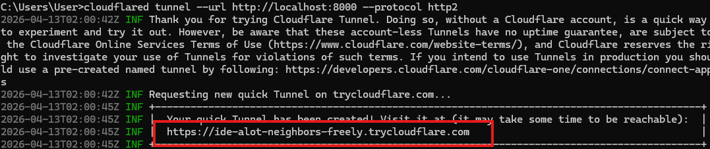
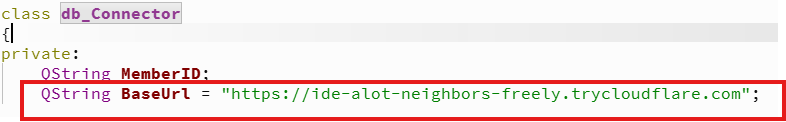

# RunningMachine

RunningMachine은 Qt/C++로 만든 러닝머신 운동 기록 시뮬레이터입니다. 운동 중 시간, 속도, 거리, 칼로리를 실시간으로 계산하고, 운동 종료 후 결과를 저장한 뒤 날짜 범위로 이전 기록을 다시 조회할 수 있도록 만들었습니다.

처음에는 Qt 데스크톱 앱 내부에서 운동 상태를 계산하고 화면에 표시하는 기능이 중심이었습니다. 이후 운동 기록을 사용자별로 남기기 위해 MySQL을 추가했고, 다른 컴퓨터에서 실행한 앱도 같은 기록 저장소를 사용할 수 있도록 Flask API 서버와 Cloudflare Quick Tunnel을 연결했습니다.

---

## 개요

### 무엇을 만든 프로그램인가

RunningMachine은 사용자가 데스크톱 앱에서 러닝머신 운동을 시뮬레이션하고, 운동 결과를 저장·조회할 수 있는 프로그램입니다.

앱에서 할 수 있는 일은 다음과 같습니다.

- ID/PW를 입력해 로그인하거나 새 회원을 생성합니다.
- 운동을 시작하면 시간, 속도, 거리, 칼로리가 실시간으로 갱신됩니다.
- 4/8/12km/h 버튼과 증감 버튼으로 속도를 조절합니다.
- 운동을 종료하면 총 운동 시간, 평균 속도, 거리, 칼로리를 확인합니다.
- 운동 결과를 서버로 보내 MySQL에 저장합니다.
- 날짜 범위를 선택해 이전 운동 기록을 조회합니다.

### 왜 만들었는가

단순히 화면에서 숫자만 변하는 앱이라면 운동을 종료하는 순간 데이터가 사라집니다. 그래서 운동 결과를 사용자별로 저장하고, 다시 조회할 수 있는 구조까지 연결하고 싶었습니다.

이 과정에서 앱은 다음처럼 확장되었습니다.

1. Qt/C++로 운동 화면과 실시간 계산 기능을 만들었습니다.
2. 운동 결과를 남기기 위해 MySQL 테이블을 설계했습니다.
3. 클라이언트가 DB에 직접 접근하지 않도록 Flask API 서버를 만들었습니다.
4. 다른 컴퓨터에서도 같은 서버에 접근할 수 있도록 Cloudflare Quick Tunnel을 사용했습니다.
5. Qt 클라이언트에서 서버 API를 호출해 저장과 조회 기능을 연결했습니다.

### 사용한 기술

| 구분 | 사용 기술 | 사용한 이유 |
|---|---|---|
| 데스크톱 앱 | Qt Widgets, C++17 | 버튼 이벤트, 화면 전환, 테이블 표시, 실시간 화면 갱신을 구현하기 위해 사용했습니다. |
| 실시간 처리 | QTimer | 일정 주기마다 운동 시간, 거리, 칼로리를 다시 계산하기 위해 사용했습니다. |
| 데이터 저장 | MySQL | 사용자와 운동 기록을 테이블로 나누어 저장하기 위해 사용했습니다. |
| API 서버 | Flask | Qt 앱과 DB 사이에서 JSON 요청을 처리하기 위해 사용했습니다. |
| DB 연결 | mysql-connector-python | Flask 서버에서 MySQL에 접근하기 위해 사용했습니다. |
| 외부 접속 | Cloudflare Quick Tunnel | 로컬 Flask 서버를 외부 HTTPS 주소로 연결하기 위해 사용했습니다. |
| 배포 | windeployqt | Qt 실행 파일에 필요한 DLL과 플러그인을 함께 구성하기 위해 사용했습니다. |

---

## 전체 구조

RunningMachine은 크게 Qt 클라이언트, Flask 서버, MySQL 데이터베이스, Cloudflare Quick Tunnel로 구성됩니다.

~~~mermaid
flowchart LR
    User[사용자] --> Qt[Qt/C++ Desktop App]
    Qt --> Calc[운동 계산 모듈]
    Qt --> Connector[db_Connector]
    Connector --> Tunnel[Cloudflare Quick Tunnel]
    Tunnel --> Flask[Flask API Server]
    Flask --> MySQL[(MySQL RunRecordDB)]
    MySQL --> Member[Member]
    MySQL --> Record[RunningRecord]
~~~

각 부분의 역할은 다음과 같습니다.

| 구성 요소 | 역할 |
|---|---|
| Qt/C++ Desktop App | 사용자가 조작하는 화면, 운동 계산, 결과 표시를 담당합니다. |
| 계산 모듈 | 시간, 속도, 거리, 칼로리를 각각 계산합니다. |
| db_Connector | Qt 앱에서 Flask API로 JSON 요청을 보냅니다. |
| Flask API Server | 회원 확인, 회원 생성, 기록 저장, 기록 조회 요청을 처리합니다. |
| MySQL | 회원 정보와 운동 기록을 저장합니다. |
| Cloudflare Quick Tunnel | 로컬 Flask 서버를 외부에서 접근 가능한 HTTPS 주소와 연결합니다. |

---

## 기술 설명과 적용 방식

### 1. Qt/C++ 클라이언트

Qt는 C++ 기반의 GUI 프레임워크입니다. 이 프로젝트에서는 Qt Widgets를 사용해 버튼, 텍스트, 테이블, 화면 전환을 구성했습니다.

Qt 클라이언트에서 담당하는 일은 다음과 같습니다.

- 로그인 화면에서 ID/PW를 입력받습니다.
- 메인 화면에서 운동 시작 또는 기록 조회로 이동합니다.
- 러닝 화면에서 운동 데이터를 실시간으로 표시합니다.
- 결과 화면에서 운동 종료 후 총 결과를 보여줍니다.
- 기록 조회 화면에서 서버로부터 받은 기록 목록을 테이블로 표시합니다.

화면 전환은 QStackedWidget을 사용했습니다. 여러 화면을 하나의 MainWindow 안에 두고, 사용자의 버튼 입력에 따라 현재 보여줄 페이지를 바꾸는 방식입니다.

#### 실시간 갱신

러닝 화면에서는 QTimer를 사용했습니다. QTimer는 일정 시간마다 지정한 함수를 호출할 수 있는 Qt의 타이머 클래스입니다. 이 프로젝트에서는 200ms마다 화면을 갱신하면서 운동 시간, 거리, 칼로리를 다시 계산합니다.

~~~cpp
void MainWindow::UpdateScreen()
{
    for(auto Cal : Calculators)
    {
        Cal->Calculate(UpdateCycle);
    }

    ui->TimeText->setText(ChangeTimeText(TimeCal_Obj->GetRunTime()));
    ui->DistanceText->setText(ChangeDistanceText(DistanceCal_Obj->GetDistance()));
    ui->CalorieText->setText(ChangeCalorieText(CalorieCal_Obj->GetCalorie()));
}
~~~

계산 로직은 한 클래스에 몰아넣지 않고 역할별 클래스로 나누었습니다.

| 클래스 | 역할 |
|---|---|
| timeCalculator | 운동 시간 누적 |
| speedCalculator | 현재 속도 변경, 평균 속도 계산 |
| distanceCalculator | 속도와 시간 간격을 이용한 거리 계산 |
| calorieCalculator | 걷기/달리기 속도 구간에 따른 칼로리 계산 |

---

### 2. MySQL 데이터베이스

운동 기록을 저장하기 위해 MySQL을 사용했습니다. 저장해야 하는 데이터는 크게 사용자 정보와 운동 기록으로 나뉩니다.

그래서 Member 테이블과 RunningRecord 테이블을 분리했습니다.

~~~sql
CREATE TABLE Member (
    member_id VARCHAR(10) PRIMARY KEY,
    password VARCHAR(10) NOT NULL,
    CHECK (member_id REGEXP '^[A-Za-z0-9]{1,10}$'),
    CHECK (password REGEXP '^[A-Za-z0-9]{1,10}$')
);

CREATE TABLE RunningRecord (
    record_id INT AUTO_INCREMENT PRIMARY KEY,
    member_id VARCHAR(10) NOT NULL,
    run_time DOUBLE NOT NULL,
    avg_speed DECIMAL(3,1) NOT NULL,
    distance DECIMAL(6,3) NOT NULL,
    calorie DECIMAL(5,1) NOT NULL,
    record_date DATETIME DEFAULT CURRENT_TIMESTAMP,
    FOREIGN KEY (member_id) REFERENCES Member(member_id)
);
~~~

Member는 사용자 ID와 비밀번호를 저장하고, RunningRecord는 운동 결과를 저장합니다. RunningRecord.member_id가 Member.member_id를 참조하므로 한 사용자가 여러 운동 기록을 가질 수 있습니다.

~~~mermaid
erDiagram
    Member ||--o{ RunningRecord : has
    Member {
        varchar member_id PK
        varchar password
    }
    RunningRecord {
        int record_id PK
        varchar member_id FK
        double run_time
        decimal avg_speed
        decimal distance
        decimal calorie
        datetime record_date
    }
~~~

DB를 설계한 뒤에는 Qt 앱이 이 DB에 어떻게 접근할지 정해야 했습니다. 클라이언트에서 DB에 직접 연결하면 DB 계정 정보가 앱 코드에 들어가고, 다른 컴퓨터에서 접근할 때 설정이 복잡해집니다. 그래서 중간에 API 서버를 두었습니다.

---

### 3. Flask API 서버

Flask는 Python으로 웹 서버와 API를 만들 수 있는 프레임워크입니다. 이 프로젝트에서는 Qt 클라이언트와 MySQL 사이의 중간 서버로 사용했습니다.

Qt 앱은 Flask 서버에 JSON 요청을 보내고, Flask 서버는 MySQL에 접근해 필요한 작업을 수행한 뒤 JSON 응답을 반환합니다.

~~~mermaid
flowchart LR
    Qt[Qt/C++ 앱] -->|JSON POST| Flask[Flask API]
    Flask -->|SQL 실행| DB[(MySQL)]
    DB --> Flask
    Flask -->|JSON 응답| Qt
~~~

#### 서버 설정

서버 실행 정보와 DB 접속 정보는 config.py에 분리했습니다.

~~~python
DB_CONFIG = {
    "host": "127.0.0.1",
    "user": "DB_USER",
    "password": "DB_PASSWORD",
    "database": "RunRecordDB"
}

SERVER_HOST = "0.0.0.0"
SERVER_PORT = 8000
~~~

SERVER_HOST를 0.0.0.0으로 설정하면, 로컬 내부 요청뿐 아니라 외부에서 들어오는 요청도 받을 수 있습니다.

#### MySQL 연결

Flask 서버는 요청을 처리할 때 MySQL에 연결합니다. 연결 직후 세션 타임존을 +09:00으로 설정해 기록 시간이 한국 시간 기준으로 저장되도록 했습니다.

~~~python
def get_connection():
    conn = mysql.connector.connect(
        host=DB_CONFIG["host"],
        user=DB_CONFIG["user"],
        password=DB_CONFIG["password"],
        database=DB_CONFIG["database"]
    )

    cursor = conn.cursor()
    cursor.execute("SET time_zone = '+09:00'")
    cursor.close()

    return conn
~~~

#### API 엔드포인트

| Endpoint | Method | 역할 |
|---|---|---|
| /member/exists | POST | 회원 ID가 이미 존재하는지 확인합니다. |
| /member/check_password | POST | 입력한 비밀번호가 DB의 비밀번호와 일치하는지 확인합니다. |
| /member/create | POST | 새 회원을 생성합니다. |
| /record/save | POST | 운동 종료 후 결과를 저장합니다. |
| /record/inquiry | POST | 날짜 범위에 해당하는 운동 기록을 조회합니다. |

기록 저장 요청은 다음과 같은 데이터를 사용합니다.

~~~json
{
  "member_id": "abc123",
  "run_time": 120.0,
  "avg_speed": 8.5,
  "distance": 0.283,
  "calorie": 15.2
}
~~~

기록 조회는 start_date와 end_date를 받아 하루 전체 범위로 확장해 조회합니다.

~~~python
start_datetime = data["start_date"] + " 00:00:00"
end_datetime = data["end_date"] + " 23:59:59"
~~~

조회 결과의 운동 시간은 초 단위 값이기 때문에, 화면에 표시하기 쉽도록 HH:MM:SS 문자열로 변환해서 반환했습니다.

---

### 4. Cloudflare Quick Tunnel

Flask 서버는 내 컴퓨터에서 실행됩니다. 같은 컴퓨터에서만 테스트한다면 http://localhost:8000 주소로 접근하면 됩니다. 하지만 다른 컴퓨터에서 실행한 Qt 앱이 이 서버에 접근하려면 외부에서 들어올 수 있는 주소가 필요합니다.

이때 사용한 것이 Cloudflare Quick Tunnel입니다.

#### Cloudflare Quick Tunnel이란

Cloudflare Tunnel은 로컬에서 실행 중인 서버를 외부에서 접근 가능한 주소와 연결해주는 기능입니다. Quick Tunnel은 별도의 도메인 설정 없이 trycloudflare.com 형태의 임시 HTTPS 주소를 발급받아 사용할 수 있는 방식입니다.

일반적으로 localhost는 내 컴퓨터 안에서만 접근할 수 있습니다. Cloudflare Quick Tunnel을 실행하면 외부 HTTPS 요청이 Cloudflare 주소로 들어오고, cloudflared가 그 요청을 내 컴퓨터의 localhost:8000으로 전달합니다.

~~~mermaid
flowchart LR
    Other[다른 컴퓨터의 Qt 앱] -->|HTTPS 요청| CF[trycloudflare.com]
    CF --> Tunnel[cloudflared]
    Tunnel --> Flask[localhost:8000 Flask 서버]
    Flask --> DB[(MySQL)]
~~~

#### 왜 사용했는가

이 프로젝트에서는 Flask 서버를 정식 서버에 배포하지 않고 로컬에서 실행했습니다. 그래도 다른 컴퓨터에서 실행한 Qt 클라이언트가 같은 서버에 요청을 보내고, 같은 DB에 기록을 저장·조회하는 흐름을 확인하고 싶었습니다.

Quick Tunnel을 사용하면 다음 흐름을 만들 수 있습니다.

1. 내 컴퓨터에서 Flask 서버를 8000번 포트로 실행합니다.
2. cloudflared가 localhost:8000을 외부 HTTPS 주소와 연결합니다.
3. Qt 앱의 BaseUrl을 trycloudflare.com 주소로 설정합니다.
4. 다른 컴퓨터에서 실행한 Qt 앱도 같은 Flask API로 요청을 보냅니다.
5. Flask 서버가 MySQL에 운동 기록을 저장하거나 조회합니다.

#### 적용 방법

Flask 서버를 실행한 뒤 다음 명령을 실행했습니다.

~~~bash
cloudflared tunnel --url http://localhost:8000 --protocol http2
~~~

명령을 실행하면 trycloudflare.com 형태의 임시 주소가 발급됩니다.

발급된 주소는 Qt 클라이언트의 BaseUrl에 넣었습니다.

Quick Tunnel 주소는 임시 주소이기 때문에 터널을 다시 실행하면 주소가 바뀔 수 있습니다. 그래서 다시 실행할 때는 새 주소를 BaseUrl에도 반영해야 합니다.

---

### 5. Qt 클라이언트와 서버 연결

Qt 클라이언트에서는 db_Connector가 서버 요청을 담당합니다. BaseUrl에는 Cloudflare Quick Tunnel로 발급받은 주소를 넣고, 기능에 맞는 API 경로를 붙여 요청합니다.

~~~cpp
QString BaseUrl = "https://ide-alot-neighbors-freely.trycloudflare.com";
~~~

회원 확인 요청 예시는 다음과 같습니다.

~~~cpp
QNetworkRequest request(QUrl(BaseUrl + "/member/exists"));
request.setHeader(QNetworkRequest::ContentTypeHeader, "application/json");

QJsonObject json;
json["member_id"] = MemberID;

QNetworkReply* reply = manager.post(request, QJsonDocument(json).toJson());
~~~

서버 응답은 QJsonDocument로 파싱합니다. 기록 조회처럼 여러 개의 결과가 오는 경우에는 records 배열을 읽어서 QTableWidget에 행 단위로 추가합니다.

---

## 데이터 흐름

사용자가 운동을 시작하고 기록을 저장한 뒤 다시 조회하는 과정은 다음 순서로 이어집니다.

~~~mermaid
sequenceDiagram
    participant User as 사용자
    participant Qt as Qt/C++ 앱
    participant API as Flask API
    participant DB as MySQL

    User->>Qt: ID/PW 입력
    Qt->>API: /member/exists 요청
    API->>DB: Member 조회
    DB-->>API: 조회 결과
    API-->>Qt: exists 반환

    User->>Qt: 운동 시작
    Qt->>Qt: QTimer 기반 실시간 계산
    User->>Qt: 운동 종료 후 저장 선택
    Qt->>API: /record/save 요청
    API->>DB: RunningRecord INSERT
    DB-->>API: 저장 완료
    API-->>Qt: success 반환

    User->>Qt: 날짜 범위 조회
    Qt->>API: /record/inquiry 요청
    API->>DB: RunningRecord SELECT
    DB-->>API: 기록 목록
    API-->>Qt: records 반환
    Qt-->>User: QTableWidget에 표시
~~~

---

## 실행 방법

전체 기능을 확인하려면 MySQL, Flask 서버, Cloudflare 터널, Qt 클라이언트가 함께 준비되어야 합니다.

### 1. MySQL 실행

RunRecordDB 데이터베이스와 Member, RunningRecord 테이블이 필요합니다.

### 2. Flask 서버 실행

~~~bash
cd RunRecordServer
venv\Scripts\activate
python app.py
~~~

서버는 0.0.0.0:8000으로 실행됩니다.

### 3. Cloudflare 터널 실행

~~~bash
cloudflared tunnel --url http://localhost:8000 --protocol http2
~~~

터널 주소가 발급되면 trycloudflare.com 주소를 확인합니다.

### 4. Qt BaseUrl 갱신

Qt 클라이언트의 BaseUrl을 현재 터널 주소로 바꿉니다.

### 5. Qt 클라이언트 실행

Qt Creator에서 실행하거나 빌드된 실행 파일을 실행합니다. 실행 파일 배포 시에는 windeployqt로 필요한 DLL과 플러그인을 함께 모읍니다.

~~~bash
windeployqt MiniProject1.exe
~~~

---

## 확인한 기능

| 확인 항목 | 내용 |
|---|---|
| 회원 확인 | 존재하는 ID와 존재하지 않는 ID를 구분합니다. |
| 비밀번호 확인 | 기존 회원의 비밀번호 일치 여부를 확인합니다. |
| 회원 생성 | 존재하지 않는 ID로 새 회원을 생성합니다. |
| 운동 실행 | QTimer를 기준으로 운동 시간이 증가하고 거리, 칼로리가 갱신됩니다. |
| 속도 조절 | 4/8/12 km/h 버튼과 증감 버튼으로 속도를 변경합니다. |
| 기록 저장 | 운동 결과가 Flask API를 통해 MySQL에 저장됩니다. |
| 기록 조회 | 날짜 범위에 맞는 기록을 조회하고 테이블에 표시합니다. |
| 터널 연결 | trycloudflare.com 주소를 통해 로컬 Flask 서버에 접근합니다. |

---

## 폴더 구조

~~~text
MiniProject_RunningMachine
├─ MiniProject1
│  ├─ main.cpp
│  ├─ mainwindow.h / mainwindow.cpp / mainwindow.ui
│  ├─ Calculator.h / Calculator.cpp
│  ├─ timecalculator.*
│  ├─ speedcalculator.*
│  ├─ distancecalculator.*
│  ├─ caloriecalculator.*
│  ├─ db_connector.h / db_connector.cpp
│  ├─ resources.qrc
│  └─ images
│     └─ Toko_Run.png
├─ RunRecordServer
│  ├─ app.py
│  └─ config.py
├─ QuerryFolder
│  ├─ Create_User.sql
│  └─ User_Script.sql
├─ image.png
├─ image-1.png
└─ README5.md
~~~

---

## 현재 한계와 다음 수정 방향

| 현재 상태 | 수정 방향 |
|---|---|
| Quick Tunnel 주소가 실행할 때마다 바뀔 수 있음 | 고정 도메인 또는 정식 서버 배포 방식으로 변경합니다. |
| BaseUrl이 코드에 직접 들어가 있음 | 설정 파일이나 환경 변수로 분리합니다. |
| config.py에 DB 접속 정보가 들어감 | config.example.py와 .env 구조로 정리합니다. |
| Qt 네트워크 요청 흐름이 단순 동기 처리에 가까움 | 비동기 Signal/Slot 구조로 개선합니다. |
| 자동화 테스트가 부족함 | 계산 모듈 단위 테스트와 API mock 테스트를 추가합니다. |
| 서버 오류 응답이 화면별로 세분화되어 있지 않음 | API 오류 메시지와 클라이언트 표시 방식을 정리합니다. |

---

## 정리

RunningMachine은 Qt/C++ 데스크톱 앱에서 출발해, 운동 기록을 저장하고 다시 조회할 수 있도록 서버와 데이터베이스를 연결한 프로젝트입니다.

전체 구조는 다음처럼 정리할 수 있습니다.

- Qt/C++ 클라이언트는 화면, 입력, 실시간 운동 계산을 담당합니다.
- MySQL은 회원 정보와 운동 기록을 저장합니다.
- Flask API 서버는 Qt 클라이언트와 MySQL 사이에서 요청을 처리합니다.
- Cloudflare Quick Tunnel은 로컬 Flask 서버를 외부 HTTPS 주소와 연결합니다.
- Qt의 db_Connector는 BaseUrl을 기준으로 서버 API를 호출하고 응답을 화면에 반영합니다.
