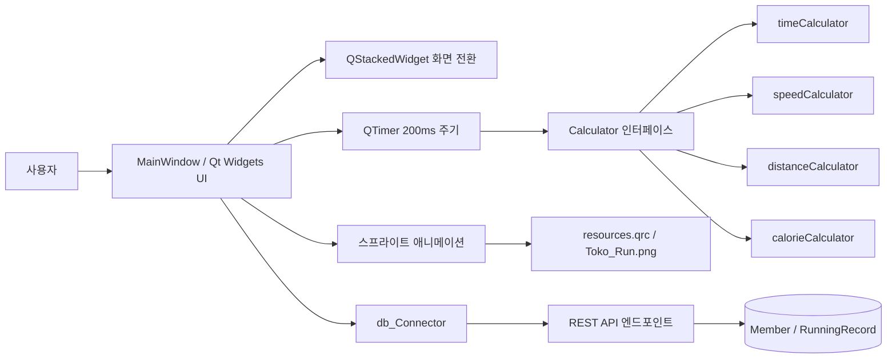
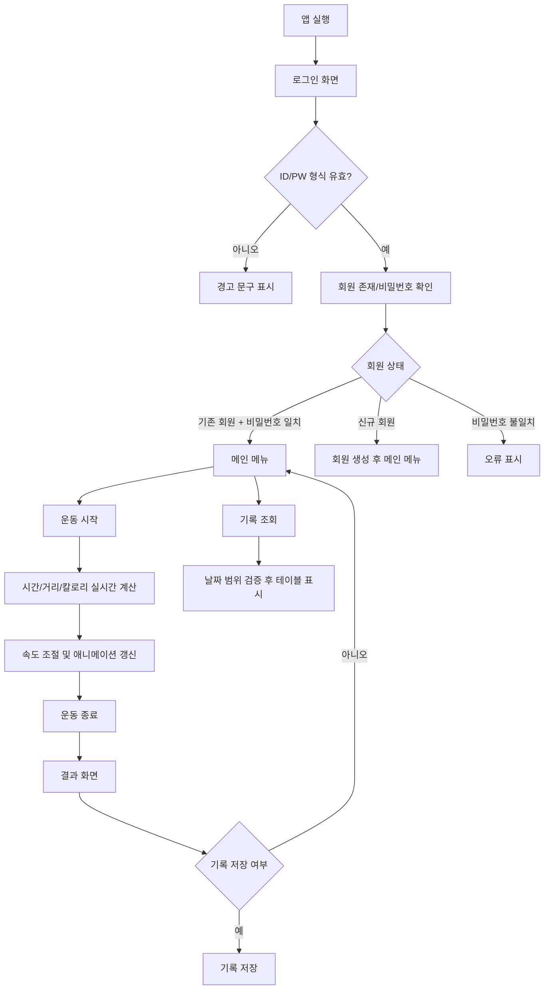

# RunningMachine

> **이력서용 한두 줄 요약**  
> Qt/C++ 기반 러닝머신 시뮬레이터를 설계·구현하여, 로그인/기록조회/운동결과 저장이 연결된 데스크톱 애플리케이션을 완성했습니다. 실시간 운동 지표 계산, 상태 전환 UI, REST API 연동, 스프라이트 애니메이션까지 하나의 사용자 흐름으로 통합한 프로젝트입니다.

```text
// 실행화면을 넣어주세요. 로그인 화면
// 실행화면을 넣어주세요. 러닝 중 화면
// 실행화면을 넣어주세요. 결과 저장 화면
// 실행 영상을 넣어주세요. 속도 조절과 애니메이션 흐름
```

## 프로젝트 개요

이 프로젝트의 애플리케이션 윈도우 제목은 `RunningMachine`이며, `QStackedWidget` 안에 **로그인 화면**, **기록 조회 화면**, **메인 메뉴**, **러닝 실행 화면**, **결과 화면**을 두고 사용자 흐름을 관리한다. 러닝 시작 후에는 시간·속도·거리·칼로리를 실시간으로 표시하고, 운동 종료 시 결과 요약을 보여준 뒤 저장 여부를 선택할 수 있다. 기록 조회 화면에서는 날짜 범위를 지정해 저장된 운동 기록을 테이블로 조회한다.

### 목적

이 프로젝트의 목적은 **러닝머신 운동을 소프트웨어적으로 시뮬레이션**하면서, 사용자 로그인부터 운동 시작, 속도 변화, 결과 계산, 기록 저장/조회까지의 전체 흐름을 하나의 데스크톱 앱 안에서 경험하게 하는 데 있다. 코드와 UI 구성상, 단순 계산기 앱이 아니라 **운동 상태를 지속적으로 갱신하는 인터랙티브 데스크톱 프로그램**으로 설계되어 있다. 

### 핵심 기능

| 기능 | 설명 |
|---|---|
| 로그인 및 회원 생성 | ID/PW는 영문·숫자 1~10자리 정규식으로 검증되며, 회원 존재 여부와 비밀번호 일치 여부를 확인한 뒤 신규 회원 생성까지 이어진다. |
| 실시간 운동 시뮬레이션 | 시작 버튼 클릭 시 계산기 모듈들이 초기화되고, 200ms 주기 타이머가 시간·거리·칼로리를 갱신한다. |
| 속도 제어 | 4/8/12 km/h 프리셋 버튼과 0.1 단위 증감 버튼을 제공하며, 속도는 0~15 km/h 범위로 제한된다. |
| 결과 화면 | 운동 종료 시 총 시간, 평균 속도, 거리, 소모 칼로리를 결과 화면에 표시하고 저장 여부를 묻는다. |
| 기록 저장 및 조회 | 기록 저장은 `/record/save`, 조회는 `/record/inquiry` 엔드포인트를 사용하며, 조회 결과는 `QTableWidget`에 날짜/시간/평균속도/거리/칼로리 순으로 출력된다. |
| 러닝 애니메이션 | 8프레임 스프라이트 시트를 `qrc`로 패키징하고, 속도에 따라 프레임 전환 간격을 동적으로 조절한다. |

## 기술 스택과 역할

| 영역 | 사용 기술 | 적용 내용 |
|---|---|---|
| 언어/빌드 | C++17, CMake 3.16+ | `CMAKE_CXX_STANDARD 17`, `AUTOUIC`, `AUTOMOC`, `AUTORCC`를 활성화한 Qt 프로젝트다. |
| UI 프레임워크 | Qt Widgets | `QMainWindow`, `QStackedWidget`, `QTableWidget`, `QPushButton`, `QDateEdit` 중심의 데스크톱 UI를 사용한다. |
| 네트워크 | Qt Network | `QNetworkAccessManager`, `QNetworkRequest`, `QNetworkReply`, `QJsonDocument` 기반으로 회원/기록 API를 호출한다. |
| 데이터 모델 | MySQL 스키마 + REST API 계약 | SQL 스크립트에는 `Member`, `RunningRecord` 테이블이 있고, 클라이언트는 현재 직접 SQL이 아니라 HTTP API를 호출한다. |
| 국제화 | Qt Linguist | `MiniProject1_ko_KR.ts`가 빌드 대상에 포함되고, 실행 시 시스템 언어에 맞춰 번역 파일을 로드한다. |
| 리소스 관리 | Qt Resource System | `resources.qrc`에 `images/Toko_Run.png`를 포함해 실행 파일과 함께 리소스를 배포하도록 구성했다. |

## 아키텍처와 구성 요소

현재 구조의 중심은 `MainWindow`다. `MainWindow`는 로그인/메뉴/러닝/결과/기록조회 화면 전환을 관리하고, 내부에 `QTimer`와 네 개의 계산기 객체, 그리고 `db_Connector`를 보유한다. 계산기 객체들은 `Calculator` 인터페이스를 통해 동일한 방식으로 초기화(`RunStart`) 및 주기 업데이트(`Calculate`)를 받으며, `db_Connector`는 회원 확인과 기록 저장/조회 요청을 API로 전달한다.



러닝 흐름은 로그인 단계에서 ID/PW 형식을 검사하고, 회원 존재 여부 및 비밀번호 일치 여부를 확인한 뒤, 메인 메뉴에서 시작을 누르면 네 개 계산기의 상태를 초기화하고 러닝 화면으로 전환하는 방식이다. 이후 러닝 중에는 실시간 지표와 애니메이션이 갱신되고, 종료 시 결과 화면으로 이동하며 저장 여부를 선택한다. 기록 조회는 날짜 범위를 사용한다.



### 주요 모듈

| 모듈 | 책임 | 핵심 포인트 |
|---|---|---|
| `MainWindow` | 전체 UI 상태, 이벤트 연결, 결과 표시 | 슬롯 기반 이벤트 처리와 `QStackedWidget` 화면 전환의 중심이다. |
| `Calculator` | 공통 계산 인터페이스 | `Calculate(int)`와 `RunStart(double)`를 강제해 계산기 모듈을 일관된 구조로 묶는다.  |
| `timeCalculator` | 운동 시간 누적 | `RunTime += Value / 1000` 방식으로 ms 단위를 초 단위 누적으로 변환한다.|
| `distanceCalculator` | 이동 거리 계산 | 현재 속도와 업데이트 주기를 이용해 `km` 기준 거리를 누적한다.|
| `speedCalculator` | 속도 범위 관리, 평균 속도 산출 | 0~15km/h 범위를 0.1 단위로 제어하고, 평균 속도는 거리/시간으로 계산한다. |
| `calorieCalculator` | 칼로리 계산 | 속도 구간에 따라 서로 다른 계수를 사용하고, 70kg 가정으로 kcal를 계산한다. |
| `db_Connector` | 회원/기록 API 통신 | 회원 확인, 비밀번호 확인, 회원 생성, 기록 저장, 기록 조회를 JSON POST로 수행한다.  |
| `resources.qrc` | 런닝 애니메이션 리소스 패키징 | `images/Toko_Run.png` 스프라이트를 빌드 결과물에 포함한다. |

## 주요 구현과 알고리즘

이 프로젝트의 좋은 점은 “수치 계산”을 UI 코드에 흩뿌리지 않고, **계산기 객체로 분리한 뒤 타이머가 일괄 호출하는 구조**를 적용했다는 것이다. `MainWindow` 생성자에서 속도·시간·거리·칼로리 계산 객체를 만들고, 이들을 `Calculators` 벡터에 넣은 다음, 시작 버튼을 누르면 모든 계산기에 `RunStart()`를 호출하고, 이후 `QTimer`가 200ms마다 `UpdateScreen()`을 불러 각 계산기의 `Calculate()`를 실행한다.

시간 계산은 가장 단순하고 명확하다. `timeCalculator`는 매 업데이트마다 `RunTime += Value / 1000`을 수행하므로, 200ms 갱신 주기에서 실제 경과 시간이 그대로 누적된다. 거리 계산은 `CurrentSpeed * (((UpdateCycle / 1000) / 3600))` 공식을 사용해 km/h를 시간 단위로 환산한 뒤 누적하고, 평균 속도는 운동 종료 시 `Distance / (RunTime / 3600.0)`으로 계산한다. 즉, “현재 속도”와 “평균 속도”를 분리한 것이 이 구현의 장점이다.

칼로리 계산은 프로젝트에서 가장 설명하기 좋은 알고리즘 포인트다. 현재 구현은 속도가 0 이하이면 산소 소비량을 0으로 두고, **5km/h 이하에서는 걷기 계수 0.1**, 초과 시에는 **달리기 계수 0.2**를 적용해 산소 소비량을 계산한다. 그런 다음 산소 1L당 약 5kcal 소모 원리를 반영하고, 체중은 70kg로 고정해 `kcal/min` 값을 만든 뒤, 다시 업데이트 주기 당 소비 칼로리로 환산한다. 포트폴리오에서는 이를 “속도 구간에 따른 칼로리 추정 모델을 적용한 실시간 운동 시뮬레이션”으로 소개하면 좋다.

로그인과 기록 저장/조회의 핵심은 `db_Connector`다. 최신 코드 기준으로 클라이언트는 MySQL에 직접 붙지 않고, `BaseUrl` 아래의 `/member/exists`, `/member/check_password`, `/member/create`, `/record/save`, `/record/inquiry` 엔드포인트에 JSON을 POST한다. 응답은 `exists`, `match`, `success`, `records` 같은 JSON 필드로 파싱된다. 이 때문에 프로젝트는 **데스크톱 UI + API 클라이언트 + 별도 데이터 저장 계층**이라는 3층 구조로 해석할 수 있다. 다만 이 해석은 저장소 안에 서버 구현 코드가 없다는 점을 함께 고려해야 한다.

스프라이트 애니메이션 구현도 채용 관점에서 보여주기 좋다. `resources.qrc`에 포함된 `Toko_Run.png`를 로드한 뒤, 전체 이미지를 8프레임으로 나누고, `CurrentFrame`을 증가시키며 좌우 두 개 라벨에 표시한다. 한쪽은 원본, 다른 한쪽은 좌우 반전 변환을 적용해 시각적으로 더 풍성한 러닝 화면을 만든다. 프레임 전환 간격은 `maxInterval - (speed/maxSpeed)*(maxInterval-minInterval)` 공식을 사용하므로, 속도가 빨라질수록 애니메이션도 빨라진다.

추가로 눈여겨볼 구현 디테일이 있다. 로그인 시 ID/PW는 `^[A-Za-z0-9]{1,10}$` 정규식으로 검증되며, 비밀번호 입력란은 기본적으로 마스킹되고 `Show PW` 버튼으로 토글된다. 기록 조회에서는 시작 날짜가 종료 날짜보다 늦으면 경고 문구를 출력하고 조회를 중단한다. 이런 검증 로직은 프로젝트의 완성도를 높여 준다. 

## 설치 및 실행 방법

이 저장소에서 **빌드 가능한 클라이언트 코드**는 명확하지만, **완전한 기능 재현에는 외부 백엔드가 필요하다**. 이유는 최신 `db_connector`가 하드코딩된 `BaseUrl`을 이용해 REST API를 호출하고, 저장소에는 MySQL 스키마 SQL은 포함되어 있어도 서버 구현은 포함되어 있지 않기 때문이다. 또한 루트 README에는 과거 ODBC/MySQL 직접 연결 방식 설명이 남아 있어, 최신 코드와 문서 사이에 실행 방식 차이가 존재한다.

### 준비 사항

1. **Qt 6 개발 환경 설치**: 프로젝트는 `Widgets`, `Sql`, `Network`, `LinguistTools`를 요구하며 C++17을 사용한다.  
2. **CMake 3.16 이상**: `cmake_minimum_required(VERSION 3.16)`로 선언되어 있다. 
3. **백엔드 준비**: 최신 클라이언트는 `/member/exists`, `/member/check_password`, `/member/create`, `/record/save`, `/record/inquiry` 엔드포인트를 기대한다. 
4. **데이터베이스 스키마 준비**: SQL 스크립트 기준 `RunRecordDB`, `Member`, `RunningRecord`가 필요하다.

### 권장 실행 절차

1. 저장소를 클론한다.  
   ```bash
   git clone https://github.com/Kim-Ye-Sung/MiniProject_RunningMachine.git
   cd MiniProject_RunningMachine/MiniProject1
   ```

2. Qt Creator로 `MiniProject1/CMakeLists.txt`를 열거나, CMake로 직접 빌드한다. 현재 CMake에는 `main.cpp`, `mainwindow.*`, 계산기 모듈, `db_connector.*`, `resources.qrc`가 모두 타깃에 포함되어 있다. 
   ```bash
   cmake -S . -B build
   cmake --build build
   ```

3. `db_connector.h`의 `BaseUrl`을 실제로 동작하는 백엔드 주소로 교체한다. 코드상 현재 문자열은 Cloudflare 터널 URL이며, 클라이언트는 여기에 JSON POST 요청을 보낸다. 

4. 백엔드가 MySQL을 사용한다면, SQL 스크립트를 기준으로 DB와 테이블을 준비한다. 다만 **최신 클라이언트는 직접 MySQL에 접속하지 않으므로**, 이 스키마를 읽고 처리해 줄 별도 서버가 필요하다. 루트 README의 ODBC 안내는 현재 코드 경로와 일치하지 않는다. 

5. 애플리케이션을 실행한다. 스프라이트 이미지는 `qrc`에 포함되어 있어, 리소스 설정이 정상이라면 별도 이미지 복사는 필수가 아니다.

### API 계약 요약

아래는 현재 클라이언트 코드가 요구하는 최소 계약이다. 이는 설치 가이드에서 특히 중요하다. 

| 엔드포인트 | 요청 필드 | 기대 응답 |
|---|---|---|
| `/member/exists` | `member_id` | `{"exists": true/false}` 형태를 기대한다.|
| `/member/check_password` | `member_id`, `password` | `{"match": true/false}`를 기대한다. |
| `/member/create` | `member_id`, `password` | 성공/실패 로그를 남기며 회원 생성에 사용된다. |
| `/record/save` | `member_id`, `run_time`, `avg_speed`, `distance`, `calorie` | `{"success": true/false}`를 기대한다. |
| `/record/inquiry` | `member_id`, `start_date`, `end_date` | `{"success": ..., "records": [...]}` 구조를 기대한다. |

## 테스트 및 예상 결과

자동화 테스트나 CI 설정은 저장소에서 확인되지 않는다. `MiniProject1` 파일 목록과 `CMakeLists.txt`를 보면 테스트 타깃이나 Qt Test 의존성은 보이지 않고, 대신 핵심 실행 파일과 UI/계산기/네트워크 코드가 중심이다. 따라서 현재 포트폴리오 README에서는 **수동 테스트 시나리오와 예상 결과**를 명확히 제시하는 방식이 가장 실용적이다. 

### 수동 테스트 시나리오

| 시나리오 | 입력/행동 | 예상 결과 |
|---|---|---|
| 로그인 형식 검증 | ID 또는 PW에 특수문자/11자 이상 입력 후 로그인 | “영어와 숫자 1~10자리” 경고가 표시되고 진행되지 않는다. |
| 신규 회원 흐름 | 존재하지 않는 ID/PW로 로그인 | 신규 ID 생성 여부를 묻고, `Yes` 선택 시 회원 생성 후 메인 메뉴로 이동한다. |
| 러닝 시작 | 메인 메뉴에서 시작 버튼 클릭 | 러닝 화면으로 전환되고 시간/거리/칼로리 집계가 시작된다. 초기 속도는 `InitSpeed = 4.0` 기준으로 시작한다. |
| 속도 조절 | 4/8/12 버튼 또는 ↑/↓ 버튼 사용 | 현재 속도 표시가 바뀌고, 속도 증가 시 애니메이션이 재개·가속된다. 속도는 0~15 범위를 넘지 않는다. |
| 운동 종료 | Stop 버튼 클릭 | 결과 화면에서 총 시간, 평균 속도, 거리, 칼로리가 표시된다. |
| 기록 조회 날짜 오류 | 시작일 > 종료일 상태에서 조회 | 날짜 경고 문구가 나타나고 조회를 중단한다. |
| 기록 없음 | 조건에 맞는 데이터가 없을 때 조회 | “조건에 맞는 데이터가 하나도 없습니다” 메시지가 출력된다. |

### 예시 결과

현재 계산식으로 보면, **속도 8.0km/h로 30분 러닝**했을 때 예상 거리는 `4.0 km`이고, 평균 속도는 동일하게 `8.0 km/h`이며, 칼로리는 현재 코드 기준 약 `316.75 kcal` 수준이다. 이 값은 `distanceCalculator`의 거리 환산식, `speedCalculator`의 평균 속도 공식, `calorieCalculator`의 70kg 가정 칼로리 공식에 따라 계산한 예시다. 

반대로 **속도 4.0km/h로 10분 걷기**를 가정하면 예상 거리는 약 `0.667 km`, 칼로리는 약 `35.58 kcal`다. 이 예시는 포트폴리오 면접에서 “코드가 실제로 어떤 숫자를 만들어내는지 

```text
// 실행화면을 넣어주세요. 기록 조회 결과 테이블
// 실행화면을 넣어주세요. 잘못된 날짜 범위 경고 메시지
```

## 개선점과 확장 아이디어

가장 먼저 개선할 부분은 **백엔드 재현성**이다. 최신 클라이언트는 REST API를 호출하지만 저장소에는 그 서버 구현이 없고, SQL 스크립트와 과거 ODBC 안내만 남아 있다. 따라서 포트폴리오 완성도를 높이려면, 서버 저장소 링크 또는 간단한 API 명세 문서, `.env` 기반 설정 파일, 로컬 개발용 mock 서버를 함께 제공하는 것이 좋다. 이렇게 하면 “작동 원리”뿐 아니라 “재현 가능한 프로젝트”로 평가받을 수 있다.

두 번째는 **네트워크 호출의 비동기화**다. 현재 `db_Connector`는 각 요청마다 `QEventLoop`를 열어 응답을 기다리는 구조다. 이 방식은 구현이 단순하다는 장점이 있지만, 구조상 네트워크 지연이 길어질수록 UI 체감 지연으로 이어질 수 있다. 채용 관점에서는 “초기 버전은 동기 요청으로 단순 구현, 이후 비동기 시그널/슬롯 구조로 개선 가능”이라고 설명하면 오히려 설계 감각을 보여주기 좋다.

세 번째는 **설정값과 민감정보 외부화**다. 현재 저장소에는 `BaseUrl`이 코드에 하드코딩되어 있고, SQL 스크립트와 루트 README에는 DB 계정과 비밀번호 예시가 직접 적혀 있다. 포트폴리오 제출용으로는 이러한 값을 설정 파일이나 환경 변수로 분리하는 편이 훨씬 성숙한 인상을 준다.

네 번째는 **크로스플랫폼 안정성**이다. 파일 목록에는 `TimeCalculator.h`가 존재하지만, 구현 파일에는 소문자 형태의 헤더 이름을 include하는 흔적이 있어 보인다. 이 차이는 Windows에서는 문제 없을 수 있지만, 대소문자 구분이 엄격한 환경에서는 빌드 이슈로 이어질 수 있다. 또한 UI 파일에는 여러 한글 폰트가 직접 지정되어 있어, 타 운영체제에서는 폰트 차이로 레이아웃이 달라질 가능성도 있다.

다섯 번째는 **테스트 체계 보강**이다. 현재는 로직 자체가 비교적 분리되어 있으므로, 거리/평균속도/칼로리 계산 모듈은 단위 테스트로 검증하기 좋은 구조다. 여기에 API 응답 mock, 날짜 검증 테스트, UI smoke test를 더하면 과제 수준을 넘어 포트폴리오용 품질로 끌어올릴 수 있다. 특히 `speedCalculator::RunStart()`가 전달받은 `SpeedValue`를 사용하지 않고 `InitSpeed = 4.0`으로 재설정하는 부분, `Calculate()`가 비어 있는 부분 같은 세부사항은 리팩터링 포인트로 제시하기 좋다. 

## 채용 포인트와 한줄 요약

채용 담당자가 이 프로젝트에서 관심을 가질 만한 포인트는 분명하다. 첫째, **실시간 상태 업데이트가 있는 데스크톱 앱을 끝까지 완성한 경험**이 보인다. 둘째, 단순 화면 전시가 아니라 **계산 로직을 별도 객체로 분리한 구조화 능력**이 있다. 셋째, 결과 저장/조회와 회원 처리 흐름을 통해 **외부 시스템 연동 경험**도 함께 보여준다. 넷째, 스프라이트 애니메이션과 결과 화면까지 포함되어 있어, 데모 시 시각적 전달력이 좋다. 

### 채용 담당자 관점에서 강조하면 좋은 문장

- **“Qt/C++ 기반 데스크톱 애플리케이션에서 실시간 계산 엔진, 상태 전환 UI, 기록 저장/조회 API를 하나의 사용자 흐름으로 통합한 프로젝트입니다.”** 
- **“운동 지표 계산 로직을 객체로 분리해 유지보수성을 확보했고, 결과 화면과 기록 조회 기능까지 포함해 사용자 경험을 완결했습니다.”** 
- **“실시간 UI 갱신과 스프라이트 애니메이션을 결합해, 기능성과 시각적 피드백을 모두 고려한 데스크톱 프로그램을 구현했습니다.”** 

### 최종 요약

RunningMachine은 수업 과제 성격의 프로젝트이지만, 현재 코드 구조만 놓고 봐도 **Qt 기반 데스크톱 개발 역량**, **객체지향 분리 설계**, **실시간 계산 처리**, **REST API 연동**, **데이터 저장/조회 흐름 설계**를 한 번에 설명할 수 있는 좋은 포트폴리오 자산이다. README를 제품 중심으로 재구성하고, 실행 방법과 재현 조건만 더 명확히 보완하면 채용 담당자에게 “기능을 끝까지 연결해 본 지원자”라는 인상을 남기기에 충분하다.